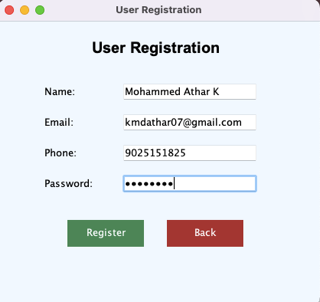
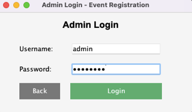
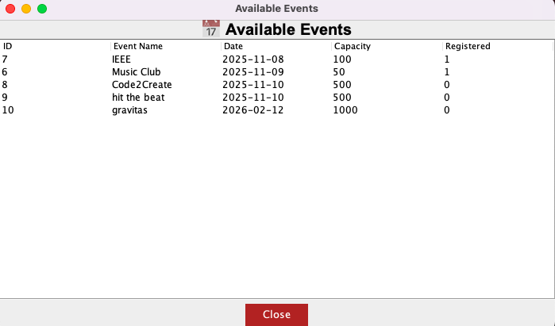

# Event Registration System

A Java Swing + MySQL application for managing event registrations.

## Features

### Admin
- Create events
- Update events
- Delete events
- View registered users

### User
- Register account
- View available events
- Register for event
- Capacity validation

## Technologies Used

- Java
- Swing (GUI)
- JDBC
- MySQL

## Screenshots

## Admin Login

## Admin Dashboard

## User Registration

## User Dashboard

## Event List

## How to Run

Compile:
# Event Registration System

A Java Swing + MySQL application for managing event registrations.

## Features

### Admin
- Create events
- Update events
- Delete events
- View registered users

### User
- Register account
- View available events
- Register for event
- Capacity validation

## Technologies Used

- Java
- Swing (GUI)
- JDBC
- MySQL

## Screenshots

## Screenshots

### Admin Login

### Admin Dashboard

### User Registration

### User Dashboard

### Event List

## How to Run

Compile:
javac -cp "lib/mysql-connector-j-9.5.0.jar" -d out src/com/event/util/DBConnection.java src/com/event/gui/*.java
Run:
java -cp "out:lib/mysql-connector-j-9.5.0.jar" com.event.gui.MainLogin
